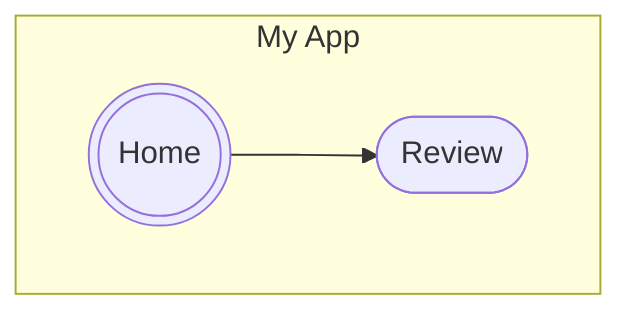
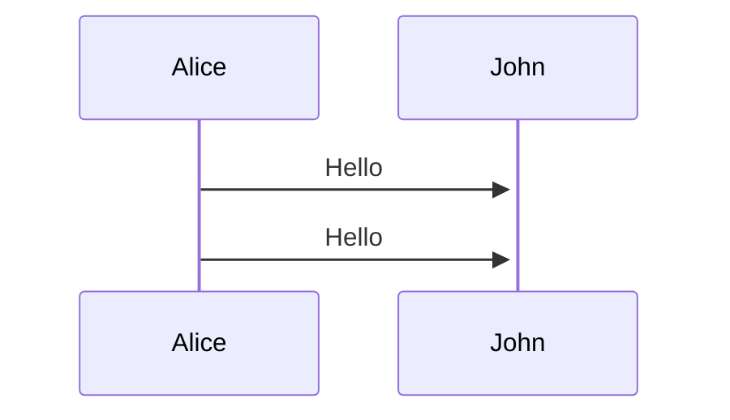

> [!NOTE]
> # PENDIENTES
> ## Validar no registros duplicados por correo  y CURP
> ## Subir archivos al servidor.
> ## Instalar disco duro al servidor
> ## Subir aplicación al servidor
> ## Crear tabla de usuarios
> ## Catálogo de escuelas detalle 
> 	* Campos incompletos
> 	* Subida del logo
> ## Si se deshabilita un estado de tipo personal entonces se deshabilita su registro.
> 	*  EJEMPLO MAESTRÍA NO EXISTE EN UNA ESCUELA ENTONCES NO DEBE APARECER SU REGISTRO.
> ## Cuando el tipo de solicitud cambie se deshabilite tambien se deshabilitará la opción solicitar solicitud.


> [!IMPORTANT]
> # EN PROCESO
> ## Envio de correos 
> 	* Cuando se registra.
> 	* Cuando se recupera.
> 	* Cuando se cuando se le atiende su correo institucional y contraseña.
> ## Interfaz y funcionalidad de recuperación de correo


> [!WARNING]
> # EN PROCESO DE AUTORIZACIÓN :shipit:
> ## Catálogo de areas departemento 
> ## Catálogo de extensiones 
> ## Validación el campo de boleta de egresados e inscritos. 
> ## Revisar la validación de boleta de maestría. B y 6 numeros. 
 

> [!TIP]
> # TERMINADOS


## MÓDULO DE CLIENTES
* 1 - Catálogo
- 2 - Catálogo


**hola**

[Enlace Link](https//:www.google.com)

```javascript
console.log("Hola Mundo")
```


  

