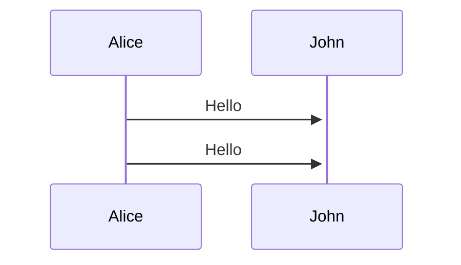

> [!NOTE]
> # PENDIENTES
> ## Subir archivos al servidor.
> ## Instalar disco duro al servidor.
> ## Crear tabla de usuarios.
> ## Catálogo de escuelas detalle
> 	* Campos incompletos
> 	* Subida del logo
> ## Si se deshabilita un estado de tipo personal entonces se deshabilita su registro.
> 	*  EJEMPLO MAESTRÍA NO EXISTE EN UNA ESCUELA ENTONCES NO DEBE APARECER SU REGISTRO.
> ## Cuando el tipo de solicitud cambie se deshabilite tambien se deshabilitará la opción solicitar solicitud.
> ## Registros upload de archivos.
> ## Registro empleados si pone la extensión en automático se pone el área o su inverso si pone el área en automático pone la extensión.
> ## Revisar el framework que sea gratuito y permita pasar a producción.
> ## Diseño del login pueda cambiar por parte del administrador.
> ## Aviso de politicas y privacidad como footer en registros.
> ## Cambio de contraseña por un show message para todo el sistema si la bandera de recuperación de contraseña esta activa.
> ## ¿Qué es? HtmlAttributes="@(new Dictionary<string, object> { { "maxlength", "10" }, { "minlength", "0" }, { "rows", false ? 3 : 1 } } )"
> ## Envio de correos 
> 	* Cuando se cuando se le atiende su correo institucional y contraseña.


> [!IMPORTANT]
> # EN PROCESO
> ## Subir aplicación al servidor.
> ## Diseño de la interfaz de perfil.


> [!WARNING]
> # EN PROCESO DE AUTORIZACIÓN :shipit:
> ## Catálogo de areas departemento. 
> ## Catálogo de extensiones.
> ## Validación el campo de boleta de egresados e inscritos. 
> ## Revisar la validación de boleta de maestría. B y 6 numeros. 
> ## Catálogo de edificios
> ## Catálogo de pisos
> ## Catálogo de enlaces
> ## Catálogo de carreras
> ## Catálogo de tipos de solicitud
> ## Catálogo de tipos de personal
> ## Catálogo de datos de la escuela
> ## Validar restricción prohibitiva de registros duplicados por correo  y CURP.
> ## Galería del login.
> ## Recuperación de correo.
> 	* Interfaz 
> 	* funcionalidad
> ## Envio de correos 
> 	* Cuando se registra.
> 	* Cuando se recupera.

> [!TIP]
> # TERMINADOS


## MÓDULO DE CLIENTES
* 1 - Catálogo
- 2 - Catálogo


**hola**

[Enlace Link](https//:www.google.com)

```javascript
console.log("Hola Mundo")
```


  

