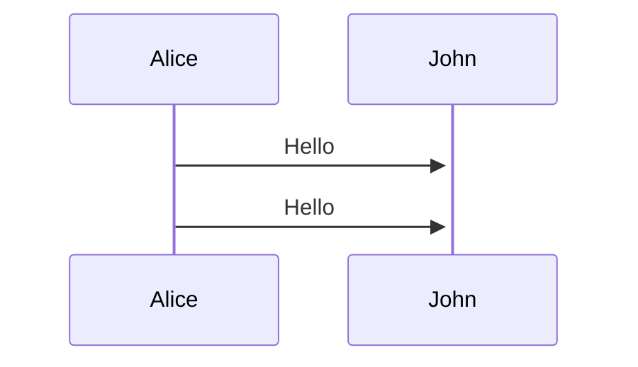

> [!NOTE]
> # PENDIENTES
> # Estudiar Radzen Blazor Studio
> ## Subir archivos al servidor.
> ## Instalar disco duro al servidor.
> ## Crear interfaz tabla de usuarios.
> ## Catálogo de escuelas detalle
> 	* Campos incompletos
> 	* Subida del logo
> ## Si se deshabilita un estado de tipo personal entonces se deshabilita su registro.
> 	*  EJEMPLO MAESTRÍA NO EXISTE EN UNA ESCUELA ENTONCES NO DEBE APARECER SU REGISTRO.
> ## Cuando el tipo de solicitud cambie se deshabilite tambien se deshabilitará la opción solicitar solicitud.
> ## Registro empleados si pone la extensión en automático se pone el área o su inverso si pone el área en automático pone la extensión.
> ## Diseño del login pueda cambiar por parte del administrador.
> ## Aviso de politicas y privacidad como footer en registros.
> ## Cambio de contraseña por un show message para todo el sistema si la bandera de recuperación de contraseña esta activa.
> ## Envio de correos 
> 	* Cuando se cuando se le atiende su correo institucional y contraseña.
> ## Catálogo de areas departemento. 
> ## Catálogo de extensiones.
> ## Catálogo de pisos
> ## Catálogo de enlaces
> ## Catálogo de carreras
> ## Catálogo de tipos de solicitud
> ## Catálogo de tipos de personal
> ## Catálogo de datos de la escuela
> ## Catálogo de edificios
> ## NO hay boton de regreso y redirige en automático al login
> ## Registro de contraseña nueva al entrar si la bandera recuperar contraseña esta activa
> ## Perfil con datos del usuario


> [!IMPORTANT]
> # EN PROCESO
> ## Tiempo de transición del slider 2 minutos para cada imagen
> ## Envio de correos 
> 	* Cuando se registra.
> ## Subir aplicación al servidor.
> ## Diseño de la interfaz de perfil.
> ## El cintillo logos uno del plantel derecho captar del catálogo


> [!WARNING]
> # EN PROCESO DE AUTORIZACIÓN :shipit:
> ## Galería del login.
> ## Recuperación de correo.
> 	* Interfaz 
> 	* funcionalidad
> ## Envio de correos 
> 	* Cuando se recupera.
> ## QUITAR parentesis de la mascara del campo de celular
> ## SLIDER de galería de fotos sin controles para el usuario
> ## Sistema para atención de correos institucionales y quitar SACI del cintillo
> ## Quitar la palabra bienvenido puedes poner SACI
> ## Footer poner 2024 y fuente menor a la que se tiene 
> ## El cintillo de color gris
> ## Registros upload de archivos.
> ## Revisar la validación de boleta de maestría. B y 6 numeros. 
> ## Validar restricción prohibitiva de registros duplicados por correo  y CURP.
> ## Validación el campo de boleta de egresados e inscritos.
> ## El cintillo logos uno de ipn izquierdo
> ## NOTAS del registro y campos obligatorios este fija en la pantalla en el body


> [!TIP]
> # TERMINADOS


## MÓDULO DE CLIENTES
* 1 - Catálogo
- 2 - Catálogo


**hola**

[Enlace Link](https//:www.google.com)

```javascript
console.log("Hola Mundo")
```


  

